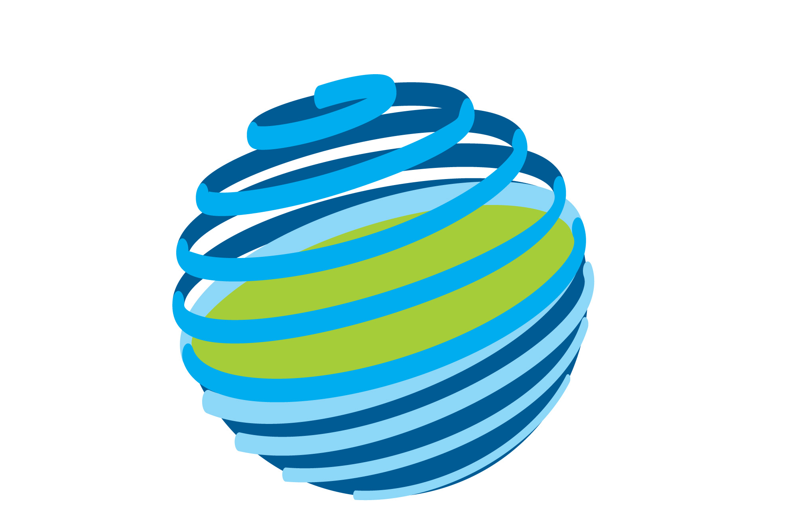

::::{grid} 2
:reverse:

:::{grid-item}
:columns: 4
:class: sd-m-auto



:::

:::{grid-item}
:columns: 8
:class: sd-fs-3
Model Evaluation and Diagnostics


% The SVG rendering breaks latex builds for the GitHub badge, so only include in HTML
```{only} html
[](https://github.com/ACCESS-NRI/ACCESS-MED)
```

:::

::::

::::{grid} 1 1 2 3
:class-container: text-center
:gutter: 3

:::{grid-item-card}
:link: ocean/metrics
:link-type: doc
:class-header: bg-light

Ocean
^^^

:::

:::{grid-item-card}
:link: atmosphere/metrics
:link-type: doc
:class-header: bg-light

Atmosphere
^^^


:::

:::{grid-item-card}
:link: land/metrics
:link-type: doc
:class-header: bg-light

Land
^^^

:::

:::{grid-item-card}
:link: ice/metrics
:link-type: doc
:class-header: bg-light

Ice
^^^

:::

:::{grid-item-card}
:link: coupled/metrics
:link-type: doc
:class-header: bg-light

Coupled
^^^

:::

::::

